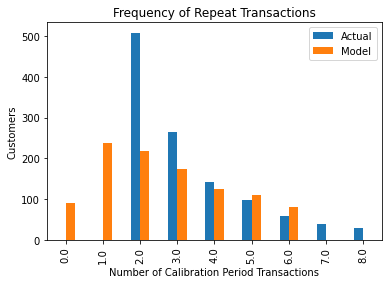
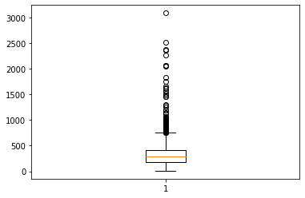

# CLTV
- 데이터셋 출처 : http://archive.ics.uci.edu/ml/datasets/Online+Retail
- 총 2년 동안의 데이터를 활용해 모델 평가.
1. 초반 1년의 데이터 학습 -> 이후 6개월 예측(1년 ~ 1년 6개월) -> 실제 데이터와 비교 평가
2. 1년 6개월 데이터 학습 -> 이후 6개월 예측(1년 6개월 ~ 2년) -> 실제 데이터와 비교 평가

- 선형회귀모델과 비교


```python
from datetime import datetime, timedelta
from dateutil.relativedelta import relativedelta


import pandas as pd
import matplotlib.pyplot as plt
from lifetimes import BetaGeoFitter
from lifetimes import GammaGammaFitter
from lifetimes.plotting import plot_period_transactions
```


```python
pd.set_option('display.max_columns', None)
pd.set_option('display.max_rows', 10)
pd.set_option('display.float_format', lambda x: '%.5f' % x)
```

# Data Preperation


```python
def outlier_thresholds(dataframe, variable):
    quartile1 = dataframe[variable].quantile(0.01)
    quartile3 = dataframe[variable].quantile(0.99)
    interquantile_range = quartile3 - quartile1
    up_limit = quartile3 + 1.5 * interquantile_range
    low_limit = quartile1 - 1.5 * interquantile_range
    return low_limit, up_limit
```


```python
def replace_with_thresholds(dataframe, variable):
    low_limit, up_limit = outlier_thresholds(dataframe, variable)
    # dataframe.loc[(dataframe[variable] < low_limit), variable] = low_limit
    dataframe.loc[(dataframe[variable] > up_limit), variable] = up_limit

```


```python
df =pd.read_excel("data/online_retail_II.xlsx",
                   sheet_name="Year 2010-2011")
```


```python
df = df_.copy()
df.head()
```


<div>

<table border="1" class="dataframe">
  <thead>
    <tr style="text-align: right;">
      <th></th>
      <th>Invoice</th>
      <th>StockCode</th>
      <th>Description</th>
      <th>Quantity</th>
      <th>InvoiceDate</th>
      <th>Price</th>
      <th>Customer ID</th>
      <th>Country</th>
    </tr>
  </thead>
  <tbody>
    <tr>
      <th>0</th>
      <td>536365</td>
      <td>85123A</td>
      <td>WHITE HANGING HEART T-LIGHT HOLDER</td>
      <td>6</td>
      <td>2010-12-01 08:26:00</td>
      <td>2.55000</td>
      <td>17850.00000</td>
      <td>United Kingdom</td>
    </tr>
    <tr>
      <th>1</th>
      <td>536365</td>
      <td>71053</td>
      <td>WHITE METAL LANTERN</td>
      <td>6</td>
      <td>2010-12-01 08:26:00</td>
      <td>3.39000</td>
      <td>17850.00000</td>
      <td>United Kingdom</td>
    </tr>
    <tr>
      <th>2</th>
      <td>536365</td>
      <td>84406B</td>
      <td>CREAM CUPID HEARTS COAT HANGER</td>
      <td>8</td>
      <td>2010-12-01 08:26:00</td>
      <td>2.75000</td>
      <td>17850.00000</td>
      <td>United Kingdom</td>
    </tr>
    <tr>
      <th>3</th>
      <td>536365</td>
      <td>84029G</td>
      <td>KNITTED UNION FLAG HOT WATER BOTTLE</td>
      <td>6</td>
      <td>2010-12-01 08:26:00</td>
      <td>3.39000</td>
      <td>17850.00000</td>
      <td>United Kingdom</td>
    </tr>
    <tr>
      <th>4</th>
      <td>536365</td>
      <td>84029E</td>
      <td>RED WOOLLY HOTTIE WHITE HEART.</td>
      <td>6</td>
      <td>2010-12-01 08:26:00</td>
      <td>3.39000</td>
      <td>17850.00000</td>
      <td>United Kingdom</td>
    </tr>
  </tbody>
</table>
</div>


```python
df = df[~df["Invoice"].str.contains("C", na=False)]   # 주문 취소 데이터 제외
df = df[df["Quantity"] > 0]                           # 수량 0개 or (-)인 데이터 제외 
len(df)
```


    531286


```python
replace_with_thresholds(df, "Quantity")     # 수량 이상치 제거 
replace_with_thresholds(df, "Price")        # 가격 이상치 제거
```


```python
df.describe([0.05, 0.25, 0.50, 0.75, 0.95, 0.99, 1]).T
```


<div>

<table border="1" class="dataframe">
  <thead>
    <tr style="text-align: right;">
      <th></th>
      <th>count</th>
      <th>mean</th>
      <th>std</th>
      <th>min</th>
      <th>5%</th>
      <th>25%</th>
      <th>50%</th>
      <th>75%</th>
      <th>95%</th>
      <th>99%</th>
      <th>100%</th>
      <th>max</th>
    </tr>
  </thead>
  <tbody>
    <tr>
      <th>Quantity</th>
      <td>531286.00000</td>
      <td>9.59067</td>
      <td>21.67303</td>
      <td>1.00000</td>
      <td>1.00000</td>
      <td>1.00000</td>
      <td>3.00000</td>
      <td>10.00000</td>
      <td>30.00000</td>
      <td>100.00000</td>
      <td>248.50000</td>
      <td>248.50000</td>
    </tr>
    <tr>
      <th>Price</th>
      <td>531286.00000</td>
      <td>3.29045</td>
      <td>21.82581</td>
      <td>-11062.06000</td>
      <td>0.42000</td>
      <td>1.25000</td>
      <td>2.08000</td>
      <td>4.13000</td>
      <td>9.95000</td>
      <td>16.98000</td>
      <td>42.13500</td>
      <td>42.13500</td>
    </tr>
    <tr>
      <th>Customer ID</th>
      <td>397925.00000</td>
      <td>15294.30860</td>
      <td>1713.17274</td>
      <td>12346.00000</td>
      <td>12627.00000</td>
      <td>13969.00000</td>
      <td>15159.00000</td>
      <td>16795.00000</td>
      <td>17912.00000</td>
      <td>18211.00000</td>
      <td>18287.00000</td>
      <td>18287.00000</td>
    </tr>
  </tbody>
</table>
</div>


```python
df["TotalPrice"] = df["Price"] * df["Quantity"]  # 총 가격 컬럼 생성 
```


```python
df["InvoiceDate"].min(), df["InvoiceDate"].max()
```


    (Timestamp('2010-12-01 08:26:00'), Timestamp('2011-12-09 12:50:00'))


```python
df = df[df["Country"] == "United Kingdom"]    # 영국 고객 데이터만 분석
df['Country'].unique()
```


    array(['United Kingdom'], dtype=object)


```python

```


```python
df_6month = df[df['InvoiceDate'] < dt.datetime(2011, 6, 1)]
```


```python
df_6month
```


<div>

<table border="1" class="dataframe">
  <thead>
    <tr style="text-align: right;">
      <th></th>
      <th>Invoice</th>
      <th>StockCode</th>
      <th>Description</th>
      <th>Quantity</th>
      <th>InvoiceDate</th>
      <th>Price</th>
      <th>Customer ID</th>
      <th>Country</th>
      <th>TotalPrice</th>
    </tr>
  </thead>
  <tbody>
    <tr>
      <th>0</th>
      <td>536365</td>
      <td>85123A</td>
      <td>WHITE HANGING HEART T-LIGHT HOLDER</td>
      <td>6.00000</td>
      <td>2010-12-01 08:26:00</td>
      <td>2.55000</td>
      <td>17850.00000</td>
      <td>United Kingdom</td>
      <td>15.30000</td>
    </tr>
    <tr>
      <th>1</th>
      <td>536365</td>
      <td>71053</td>
      <td>WHITE METAL LANTERN</td>
      <td>6.00000</td>
      <td>2010-12-01 08:26:00</td>
      <td>3.39000</td>
      <td>17850.00000</td>
      <td>United Kingdom</td>
      <td>20.34000</td>
    </tr>
    <tr>
      <th>2</th>
      <td>536365</td>
      <td>84406B</td>
      <td>CREAM CUPID HEARTS COAT HANGER</td>
      <td>8.00000</td>
      <td>2010-12-01 08:26:00</td>
      <td>2.75000</td>
      <td>17850.00000</td>
      <td>United Kingdom</td>
      <td>22.00000</td>
    </tr>
    <tr>
      <th>3</th>
      <td>536365</td>
      <td>84029G</td>
      <td>KNITTED UNION FLAG HOT WATER BOTTLE</td>
      <td>6.00000</td>
      <td>2010-12-01 08:26:00</td>
      <td>3.39000</td>
      <td>17850.00000</td>
      <td>United Kingdom</td>
      <td>20.34000</td>
    </tr>
    <tr>
      <th>4</th>
      <td>536365</td>
      <td>84029E</td>
      <td>RED WOOLLY HOTTIE WHITE HEART.</td>
      <td>6.00000</td>
      <td>2010-12-01 08:26:00</td>
      <td>3.39000</td>
      <td>17850.00000</td>
      <td>United Kingdom</td>
      <td>20.34000</td>
    </tr>
    <tr>
      <th>...</th>
      <td>...</td>
      <td>...</td>
      <td>...</td>
      <td>...</td>
      <td>...</td>
      <td>...</td>
      <td>...</td>
      <td>...</td>
      <td>...</td>
    </tr>
    <tr>
      <th>209024</th>
      <td>555150</td>
      <td>22895</td>
      <td>SET OF 2 TEA TOWELS APPLE AND PEARS</td>
      <td>3.00000</td>
      <td>2011-05-31 15:53:00</td>
      <td>3.25000</td>
      <td>NaN</td>
      <td>United Kingdom</td>
      <td>9.75000</td>
    </tr>
    <tr>
      <th>209025</th>
      <td>555150</td>
      <td>22983</td>
      <td>CARD BILLBOARD FONT</td>
      <td>3.00000</td>
      <td>2011-05-31 15:53:00</td>
      <td>0.42000</td>
      <td>NaN</td>
      <td>United Kingdom</td>
      <td>1.26000</td>
    </tr>
    <tr>
      <th>209026</th>
      <td>555150</td>
      <td>23169</td>
      <td>CLASSIC GLASS COOKIE JAR</td>
      <td>3.00000</td>
      <td>2011-05-31 15:53:00</td>
      <td>4.15000</td>
      <td>NaN</td>
      <td>United Kingdom</td>
      <td>12.45000</td>
    </tr>
    <tr>
      <th>209027</th>
      <td>555150</td>
      <td>23298</td>
      <td>SPOTTY BUNTING</td>
      <td>5.00000</td>
      <td>2011-05-31 15:53:00</td>
      <td>4.95000</td>
      <td>NaN</td>
      <td>United Kingdom</td>
      <td>24.75000</td>
    </tr>
    <tr>
      <th>209028</th>
      <td>555150</td>
      <td>23118</td>
      <td>PARISIENNE JEWELLERY DRAWER</td>
      <td>2.00000</td>
      <td>2011-05-31 15:53:00</td>
      <td>7.50000</td>
      <td>NaN</td>
      <td>United Kingdom</td>
      <td>15.00000</td>
    </tr>
  </tbody>
</table>
<p>188626 rows × 9 columns</p>
</div>


```python
# today_date = dt.datetime(2011, 12, 11)
today_date = dt.datetime(2011, 6, 3)
```

# RFM Table


```python
rfm = df_6month.groupby('Customer ID').agg({'InvoiceDate': [lambda date: (date.max()-date.min()).days,
                                                     lambda date: (today_date-date.min()).days],
                                     'Invoice': lambda num: num.nunique(),
                                     'TotalPrice': lambda price: price.sum()})
rfm.head(2)
```


<div>
<style scoped>
    .dataframe tbody tr th:only-of-type {
        vertical-align: middle;
    }

    .dataframe tbody tr th {
        vertical-align: top;
    }

    .dataframe thead tr th {
        text-align: left;
    }

    .dataframe thead tr:last-of-type th {
        text-align: right;
    }
</style>
<table border="1" class="dataframe">
  <thead>
    <tr>
      <th></th>
      <th colspan="2" halign="left">InvoiceDate</th>
      <th>Invoice</th>
      <th>TotalPrice</th>
    </tr>
    <tr>
      <th></th>
      <th>&lt;lambda_0&gt;</th>
      <th>&lt;lambda_1&gt;</th>
      <th>&lt;lambda&gt;</th>
      <th>&lt;lambda&gt;</th>
    </tr>
    <tr>
      <th>Customer ID</th>
      <th></th>
      <th></th>
      <th></th>
      <th></th>
    </tr>
  </thead>
  <tbody>
    <tr>
      <th>12346.00000</th>
      <td>0</td>
      <td>135</td>
      <td>1</td>
      <td>258.44000</td>
    </tr>
    <tr>
      <th>12747.00000</th>
      <td>170</td>
      <td>179</td>
      <td>6</td>
      <td>2091.40000</td>
    </tr>
  </tbody>
</table>
</div>


```python
rfm.columns = rfm.columns.droplevel(0)
```


```python
rfm.head(2)
```


<div>

<table border="1" class="dataframe">
  <thead>
    <tr style="text-align: right;">
      <th></th>
      <th>&lt;lambda_0&gt;</th>
      <th>&lt;lambda_1&gt;</th>
      <th>&lt;lambda&gt;</th>
      <th>&lt;lambda&gt;</th>
    </tr>
    <tr>
      <th>Customer ID</th>
      <th></th>
      <th></th>
      <th></th>
      <th></th>
    </tr>
  </thead>
  <tbody>
    <tr>
      <th>12346.00000</th>
      <td>0</td>
      <td>135</td>
      <td>1</td>
      <td>258.44000</td>
    </tr>
    <tr>
      <th>12747.00000</th>
      <td>170</td>
      <td>179</td>
      <td>6</td>
      <td>2091.40000</td>
    </tr>
  </tbody>
</table>
</div>


```python
rfm.columns = ['recency_cltv_p', 'tenure', 'frequency', 'monetary']
```


```python
#  통화 평균 계산 
rfm["monetary"] = rfm["monetary"] / rfm["frequency"]
rfm.rename(columns={"monetary": "monetary_avg"}, inplace=True)
```


```python
# 최근성 및 근속 기간 변수를 주간으로 변환
rfm["recency_weekly_p"] = rfm["recency_cltv_p"] / 7
rfm["tenure_weekly_p"] = rfm["tenure"] / 7
```


```python
rfm = rfm[rfm["monetary_avg"] > 0]
rfm = rfm[rfm["frequency"] > 1]
rfm["frequency"] = rfm["frequency"].astype(int)
```


```python
rfm
```


<div>

<table border="1" class="dataframe">
  <thead>
    <tr style="text-align: right;">
      <th></th>
      <th>recency_cltv_p</th>
      <th>tenure</th>
      <th>frequency</th>
      <th>monetary_avg</th>
      <th>recency_weekly_p</th>
      <th>tenure_weekly_p</th>
    </tr>
    <tr>
      <th>Customer ID</th>
      <th></th>
      <th></th>
      <th></th>
      <th></th>
      <th></th>
      <th></th>
    </tr>
  </thead>
  <tbody>
    <tr>
      <th>12747.00000</th>
      <td>170</td>
      <td>179</td>
      <td>6</td>
      <td>348.56667</td>
      <td>24.28571</td>
      <td>25.57143</td>
    </tr>
    <tr>
      <th>12748.00000</th>
      <td>181</td>
      <td>183</td>
      <td>86</td>
      <td>106.89436</td>
      <td>25.85714</td>
      <td>26.14286</td>
    </tr>
    <tr>
      <th>12823.00000</th>
      <td>41</td>
      <td>106</td>
      <td>3</td>
      <td>331.50000</td>
      <td>5.85714</td>
      <td>15.14286</td>
    </tr>
    <tr>
      <th>12826.00000</th>
      <td>48</td>
      <td>175</td>
      <td>3</td>
      <td>232.36667</td>
      <td>6.85714</td>
      <td>25.00000</td>
    </tr>
    <tr>
      <th>12829.00000</th>
      <td>23</td>
      <td>170</td>
      <td>2</td>
      <td>146.50000</td>
      <td>3.28571</td>
      <td>24.28571</td>
    </tr>
    <tr>
      <th>...</th>
      <td>...</td>
      <td>...</td>
      <td>...</td>
      <td>...</td>
      <td>...</td>
      <td>...</td>
    </tr>
    <tr>
      <th>18245.00000</th>
      <td>143</td>
      <td>165</td>
      <td>4</td>
      <td>326.57250</td>
      <td>20.42857</td>
      <td>23.57143</td>
    </tr>
    <tr>
      <th>18257.00000</th>
      <td>89</td>
      <td>106</td>
      <td>3</td>
      <td>240.40000</td>
      <td>12.71429</td>
      <td>15.14286</td>
    </tr>
    <tr>
      <th>18260.00000</th>
      <td>152</td>
      <td>168</td>
      <td>5</td>
      <td>443.21400</td>
      <td>21.71429</td>
      <td>24.00000</td>
    </tr>
    <tr>
      <th>18272.00000</th>
      <td>21</td>
      <td>56</td>
      <td>2</td>
      <td>490.27000</td>
      <td>3.00000</td>
      <td>8.00000</td>
    </tr>
    <tr>
      <th>18283.00000</th>
      <td>136</td>
      <td>147</td>
      <td>5</td>
      <td>107.01000</td>
      <td>19.42857</td>
      <td>21.00000</td>
    </tr>
  </tbody>
</table>
<p>1252 rows × 6 columns</p>
</div>


# BG/NBD 모델 구축


```python
bgf = BetaGeoFitter(penalizer_coef=0.001)
bgf.fit(rfm['frequency'],
        rfm['recency_weekly_p'],
        rfm['tenure_weekly_p'])
```


    <lifetimes.BetaGeoFitter: fitted with 1252 subjects, a: 0.25, alpha: 10.84, b: 3.06, r: 2.97>


```python
# 3개월 동안 가장 많이 구매할 것으로 예상되는 10명의 고객(구매횟수)
bgf.conditional_expected_number_of_purchases_up_to_time(3*4,
                                                        rfm['frequency'],
                                                        rfm['recency_weekly_p'],
                                                        rfm['tenure_weekly_p']).sort_values(ascending=False).head(10)
```


    Customer ID
    12748.00000   27.68437
    13089.00000   16.47640
    14606.00000   15.73674
    17841.00000   15.49392
    15311.00000   14.15373
    12971.00000   12.93218
    13798.00000   10.77557
    16029.00000    9.75969
    13694.00000    8.95092
    14527.00000    8.94763
    dtype: float64


```python
# 3개월 예측 구매 횟수
rfm["exp_sales_3_month"] = bgf.predict(3*4,
                                        rfm['frequency'],
                                        rfm['recency_weekly_p'],
                                        rfm['tenure_weekly_p'])
```


```python
rfm.sort_values("exp_sales_3_month", ascending=False).head(20)
```


<div>

<table border="1" class="dataframe">
  <thead>
    <tr style="text-align: right;">
      <th></th>
      <th>recency_cltv_p</th>
      <th>tenure</th>
      <th>frequency</th>
      <th>monetary_avg</th>
      <th>recency_weekly_p</th>
      <th>tenure_weekly_p</th>
      <th>exp_sales_3_month</th>
    </tr>
    <tr>
      <th>Customer ID</th>
      <th></th>
      <th></th>
      <th></th>
      <th></th>
      <th></th>
      <th></th>
      <th></th>
    </tr>
  </thead>
  <tbody>
    <tr>
      <th>12748.00000</th>
      <td>181</td>
      <td>183</td>
      <td>86</td>
      <td>106.89436</td>
      <td>25.85714</td>
      <td>26.14286</td>
      <td>27.68437</td>
    </tr>
    <tr>
      <th>13089.00000</th>
      <td>169</td>
      <td>179</td>
      <td>51</td>
      <td>547.28431</td>
      <td>24.14286</td>
      <td>25.57143</td>
      <td>16.47640</td>
    </tr>
    <tr>
      <th>14606.00000</th>
      <td>178</td>
      <td>183</td>
      <td>48</td>
      <td>141.28667</td>
      <td>25.42857</td>
      <td>26.14286</td>
      <td>15.73674</td>
    </tr>
    <tr>
      <th>17841.00000</th>
      <td>180</td>
      <td>183</td>
      <td>47</td>
      <td>245.31106</td>
      <td>25.71429</td>
      <td>26.14286</td>
      <td>15.49392</td>
    </tr>
    <tr>
      <th>15311.00000</th>
      <td>177</td>
      <td>183</td>
      <td>43</td>
      <td>689.53721</td>
      <td>25.28571</td>
      <td>26.14286</td>
      <td>14.15373</td>
    </tr>
    <tr>
      <th>...</th>
      <td>...</td>
      <td>...</td>
      <td>...</td>
      <td>...</td>
      <td>...</td>
      <td>...</td>
      <td>...</td>
    </tr>
    <tr>
      <th>16333.00000</th>
      <td>117</td>
      <td>119</td>
      <td>16</td>
      <td>424.18063</td>
      <td>16.71429</td>
      <td>17.00000</td>
      <td>7.66812</td>
    </tr>
    <tr>
      <th>13767.00000</th>
      <td>170</td>
      <td>183</td>
      <td>22</td>
      <td>329.14955</td>
      <td>24.28571</td>
      <td>26.14286</td>
      <td>7.52967</td>
    </tr>
    <tr>
      <th>13468.00000</th>
      <td>171</td>
      <td>183</td>
      <td>21</td>
      <td>171.00571</td>
      <td>24.42857</td>
      <td>26.14286</td>
      <td>7.25415</td>
    </tr>
    <tr>
      <th>17811.00000</th>
      <td>133</td>
      <td>143</td>
      <td>17</td>
      <td>230.49882</td>
      <td>19.00000</td>
      <td>20.42857</td>
      <td>7.10709</td>
    </tr>
    <tr>
      <th>17961.00000</th>
      <td>175</td>
      <td>182</td>
      <td>20</td>
      <td>39.57625</td>
      <td>25.00000</td>
      <td>26.00000</td>
      <td>7.06173</td>
    </tr>
  </tbody>
</table>
<p>20 rows × 7 columns</p>
</div>


```python
rfm.exp_sales_3_month.sum()
```


    2920.7394303906794


```python
# 3개월 동안 회사 전체의 예상 구매 횟수
bgf.predict(4*3,
            rfm['frequency'],
            rfm['recency_weekly_p'],
            rfm['tenure_weekly_p']).sum()
```


    2920.7394303906794


```python
# 예측 결과 평가
plot_period_transactions(bgf)
plt.show()
```


    

    


# GAMMA-GAMMA 모델 구축
- It is used to estimate the average monetary value of customer transactions.


```python
ggf = GammaGammaFitter(penalizer_coef=0.01)  
ggf.fit(rfm['frequency'], rfm['monetary_avg'])
```


    <lifetimes.GammaGammaFitter: fitted with 1252 subjects, p: 3.82, q: 0.35, v: 3.75>


```python
rfm.head(2)
```


<div>

<table border="1" class="dataframe">
  <thead>
    <tr style="text-align: right;">
      <th></th>
      <th>recency_cltv_p</th>
      <th>tenure</th>
      <th>frequency</th>
      <th>monetary_avg</th>
      <th>recency_weekly_p</th>
      <th>tenure_weekly_p</th>
      <th>exp_sales_3_month</th>
    </tr>
    <tr>
      <th>Customer ID</th>
      <th></th>
      <th></th>
      <th></th>
      <th></th>
      <th></th>
      <th></th>
      <th></th>
    </tr>
  </thead>
  <tbody>
    <tr>
      <th>12747.00000</th>
      <td>170</td>
      <td>179</td>
      <td>6</td>
      <td>348.56667</td>
      <td>24.28571</td>
      <td>25.57143</td>
      <td>2.72920</td>
    </tr>
    <tr>
      <th>12748.00000</th>
      <td>181</td>
      <td>183</td>
      <td>86</td>
      <td>106.89436</td>
      <td>25.85714</td>
      <td>26.14286</td>
      <td>27.68437</td>
    </tr>
  </tbody>
</table>
</div>


```python
rfm.sort_values('monetary_avg', ascending=False).head(20)
```


<div>

<table border="1" class="dataframe">
  <thead>
    <tr style="text-align: right;">
      <th></th>
      <th>recency_cltv_p</th>
      <th>tenure</th>
      <th>frequency</th>
      <th>monetary_avg</th>
      <th>recency_weekly_p</th>
      <th>tenure_weekly_p</th>
      <th>exp_sales_3_month</th>
    </tr>
    <tr>
      <th>Customer ID</th>
      <th></th>
      <th></th>
      <th></th>
      <th></th>
      <th></th>
      <th></th>
      <th></th>
    </tr>
  </thead>
  <tbody>
    <tr>
      <th>18102.00000</th>
      <td>160</td>
      <td>177</td>
      <td>15</td>
      <td>3088.61100</td>
      <td>22.85714</td>
      <td>25.28571</td>
      <td>5.47086</td>
    </tr>
    <tr>
      <th>15749.00000</th>
      <td>97</td>
      <td>142</td>
      <td>3</td>
      <td>2521.44667</td>
      <td>13.85714</td>
      <td>20.28571</td>
      <td>1.84161</td>
    </tr>
    <tr>
      <th>12939.00000</th>
      <td>61</td>
      <td>144</td>
      <td>3</td>
      <td>2375.96500</td>
      <td>8.71429</td>
      <td>20.57143</td>
      <td>1.19255</td>
    </tr>
    <tr>
      <th>17511.00000</th>
      <td>167</td>
      <td>183</td>
      <td>15</td>
      <td>2367.25933</td>
      <td>23.85714</td>
      <td>26.14286</td>
      <td>5.37392</td>
    </tr>
    <tr>
      <th>17450.00000</th>
      <td>175</td>
      <td>177</td>
      <td>14</td>
      <td>2273.48214</td>
      <td>25.00000</td>
      <td>25.28571</td>
      <td>5.33352</td>
    </tr>
    <tr>
      <th>...</th>
      <td>...</td>
      <td>...</td>
      <td>...</td>
      <td>...</td>
      <td>...</td>
      <td>...</td>
      <td>...</td>
    </tr>
    <tr>
      <th>15769.00000</th>
      <td>173</td>
      <td>181</td>
      <td>13</td>
      <td>1490.12269</td>
      <td>24.71429</td>
      <td>25.85714</td>
      <td>4.89730</td>
    </tr>
    <tr>
      <th>14769.00000</th>
      <td>156</td>
      <td>167</td>
      <td>4</td>
      <td>1459.33750</td>
      <td>22.28571</td>
      <td>23.85714</td>
      <td>2.19104</td>
    </tr>
    <tr>
      <th>17340.00000</th>
      <td>173</td>
      <td>176</td>
      <td>4</td>
      <td>1450.70250</td>
      <td>24.71429</td>
      <td>25.14286</td>
      <td>2.13986</td>
    </tr>
    <tr>
      <th>14895.00000</th>
      <td>85</td>
      <td>100</td>
      <td>3</td>
      <td>1306.59333</td>
      <td>12.14286</td>
      <td>14.28571</td>
      <td>2.49193</td>
    </tr>
    <tr>
      <th>13124.00000</th>
      <td>106</td>
      <td>169</td>
      <td>2</td>
      <td>1287.06000</td>
      <td>15.14286</td>
      <td>24.14286</td>
      <td>1.29110</td>
    </tr>
  </tbody>
</table>
<p>20 rows × 7 columns</p>
</div>


```python
rfm.monetary_avg.describe([0, .25, .5, .75, .8, .85, .9, .95])
```


    count   1252.00000
    mean     350.07700
    std      280.78148
    min       10.65500
    0%        10.65500
               ...    
    80%      464.52238
    85%      522.10550
    90%      596.19204
    95%      825.21121
    max     3088.61100
    Name: monetary_avg, Length: 13, dtype: float64


```python
import matplotlib.pyplot as plt
plt.boxplot(rfm.monetary_avg);
```


    

    


```python
# conditional_expected_average_profit : 평균이익의 조건부 기대값을 계산
# 고객의 기대 구입액 계산
ggf.conditional_expected_average_profit(rfm['frequency'],
                                        rfm['monetary_avg']).sort_values(ascending=False).head(10)
```


    Customer ID
    18102.00000   3124.47245
    15749.00000   2675.14762
    12939.00000   2520.87416
    17511.00000   2394.80426
    17450.00000   2301.85954
    17107.00000   2253.95150
    15251.00000   2241.32736
    13081.00000   2118.49202
    15125.00000   1910.26359
    16684.00000   1783.89693
    dtype: float64


```python
rfm["expected_average_profit"] = ggf.conditional_expected_average_profit(rfm['frequency'],
                                                                         rfm['monetary_avg'])
```


```python
rfm.sort_values("expected_average_profit", ascending=False)
```


<div>

<table border="1" class="dataframe">
  <thead>
    <tr style="text-align: right;">
      <th></th>
      <th>recency_cltv_p</th>
      <th>tenure</th>
      <th>frequency</th>
      <th>monetary_avg</th>
      <th>recency_weekly_p</th>
      <th>tenure_weekly_p</th>
      <th>exp_sales_3_month</th>
      <th>expected_average_profit</th>
    </tr>
    <tr>
      <th>Customer ID</th>
      <th></th>
      <th></th>
      <th></th>
      <th></th>
      <th></th>
      <th></th>
      <th></th>
      <th></th>
    </tr>
  </thead>
  <tbody>
    <tr>
      <th>18102.00000</th>
      <td>160</td>
      <td>177</td>
      <td>15</td>
      <td>3088.61100</td>
      <td>22.85714</td>
      <td>25.28571</td>
      <td>5.47086</td>
      <td>3124.47245</td>
    </tr>
    <tr>
      <th>15749.00000</th>
      <td>97</td>
      <td>142</td>
      <td>3</td>
      <td>2521.44667</td>
      <td>13.85714</td>
      <td>20.28571</td>
      <td>1.84161</td>
      <td>2675.14762</td>
    </tr>
    <tr>
      <th>12939.00000</th>
      <td>61</td>
      <td>144</td>
      <td>3</td>
      <td>2375.96500</td>
      <td>8.71429</td>
      <td>20.57143</td>
      <td>1.19255</td>
      <td>2520.87416</td>
    </tr>
    <tr>
      <th>17511.00000</th>
      <td>167</td>
      <td>183</td>
      <td>15</td>
      <td>2367.25933</td>
      <td>23.85714</td>
      <td>26.14286</td>
      <td>5.37392</td>
      <td>2394.80426</td>
    </tr>
    <tr>
      <th>17450.00000</th>
      <td>175</td>
      <td>177</td>
      <td>14</td>
      <td>2273.48214</td>
      <td>25.00000</td>
      <td>25.28571</td>
      <td>5.33352</td>
      <td>2301.85954</td>
    </tr>
    <tr>
      <th>...</th>
      <td>...</td>
      <td>...</td>
      <td>...</td>
      <td>...</td>
      <td>...</td>
      <td>...</td>
      <td>...</td>
      <td>...</td>
    </tr>
    <tr>
      <th>17961.00000</th>
      <td>175</td>
      <td>182</td>
      <td>20</td>
      <td>39.57625</td>
      <td>25.00000</td>
      <td>26.00000</td>
      <td>7.06173</td>
      <td>40.10638</td>
    </tr>
    <tr>
      <th>13666.00000</th>
      <td>0</td>
      <td>97</td>
      <td>2</td>
      <td>32.02500</td>
      <td>0.00000</td>
      <td>13.85714</td>
      <td>0.49022</td>
      <td>37.06649</td>
    </tr>
    <tr>
      <th>12970.00000</th>
      <td>0</td>
      <td>132</td>
      <td>2</td>
      <td>11.90000</td>
      <td>0.00000</td>
      <td>18.85714</td>
      <td>0.18865</td>
      <td>15.06035</td>
    </tr>
    <tr>
      <th>17816.00000</th>
      <td>96</td>
      <td>175</td>
      <td>2</td>
      <td>10.65500</td>
      <td>13.71429</td>
      <td>25.00000</td>
      <td>1.14235</td>
      <td>13.69898</td>
    </tr>
    <tr>
      <th>18037.00000</th>
      <td>137</td>
      <td>172</td>
      <td>5</td>
      <td>12.16400</td>
      <td>19.57143</td>
      <td>24.57143</td>
      <td>2.32232</td>
      <td>13.37035</td>
    </tr>
  </tbody>
</table>
<p>1252 rows × 8 columns</p>
</div>


# BG-NBD 및 GG 모델을 사용한 CLTV 계산.


```python
pre_cltv = ggf.customer_lifetime_value(bgf,
                                   rfm['frequency'],
                                   rfm['recency_weekly_p'],
                                   rfm['tenure_weekly_p'],
                                   rfm['monetary_avg'],
                                   time=3,   # 6개월
                                   freq="W",
                                   discount_rate=0.01)
```


```python
pre_cltv.head()
```


    Customer ID
    12747.00000   1041.66009
    12748.00000   3150.50282
    12823.00000    580.73791
    12826.00000    117.30980
    12829.00000     42.20822
    Name: clv, dtype: float64


```python
pre_cltv.shape
```


    (1252,)


```python
pre_cltv = pre_cltv.reset_index()
```


```python
pre_cltv.sort_values(by="clv", ascending=False).head(50)
```


<div>

<table border="1" class="dataframe">
  <thead>
    <tr style="text-align: right;">
      <th></th>
      <th>Customer ID</th>
      <th>clv</th>
    </tr>
  </thead>
  <tbody>
    <tr>
      <th>1215</th>
      <td>18102.00000</td>
      <td>18152.33062</td>
    </tr>
    <tr>
      <th>1066</th>
      <td>17511.00000</td>
      <td>13667.31932</td>
    </tr>
    <tr>
      <th>1055</th>
      <td>17450.00000</td>
      <td>13037.39311</td>
    </tr>
    <tr>
      <th>569</th>
      <td>15311.00000</td>
      <td>10407.74433</td>
    </tr>
    <tr>
      <th>202</th>
      <td>13694.00000</td>
      <td>10125.59087</td>
    </tr>
    <tr>
      <th>...</th>
      <td>...</td>
      <td>...</td>
    </tr>
    <tr>
      <th>680</th>
      <td>15856.00000</td>
      <td>3181.00009</td>
    </tr>
    <tr>
      <th>1</th>
      <td>12748.00000</td>
      <td>3150.50282</td>
    </tr>
    <tr>
      <th>760</th>
      <td>16210.00000</td>
      <td>3135.07764</td>
    </tr>
    <tr>
      <th>1108</th>
      <td>17675.00000</td>
      <td>3091.71542</td>
    </tr>
    <tr>
      <th>866</th>
      <td>16705.00000</td>
      <td>3088.91175</td>
    </tr>
  </tbody>
</table>
<p>50 rows × 2 columns</p>
</div>


```python
rfm_cltv_final = rfm.merge(pre_cltv, on="Customer ID", how="left")
rfm_cltv_final.sort_values(by="clv", ascending=False).head()
rfm_cltv_final.rename(columns={"clv": "exp_cltv"}, inplace=True)
rfm_cltv_final.head(2)
```


<div>

<table border="1" class="dataframe">
  <thead>
    <tr style="text-align: right;">
      <th></th>
      <th>Customer ID</th>
      <th>recency_cltv_p</th>
      <th>tenure</th>
      <th>frequency</th>
      <th>monetary_avg</th>
      <th>recency_weekly_p</th>
      <th>tenure_weekly_p</th>
      <th>exp_sales_3_month</th>
      <th>exp_cltv</th>
    </tr>
  </thead>
  <tbody>
    <tr>
      <th>0</th>
      <td>12747.00000</td>
      <td>170</td>
      <td>179</td>
      <td>6</td>
      <td>348.56667</td>
      <td>24.28571</td>
      <td>25.57143</td>
      <td>2.72920</td>
      <td>1041.66009</td>
    </tr>
    <tr>
      <th>1</th>
      <td>12748.00000</td>
      <td>181</td>
      <td>183</td>
      <td>86</td>
      <td>106.89436</td>
      <td>25.85714</td>
      <td>26.14286</td>
      <td>27.68437</td>
      <td>3150.50282</td>
    </tr>
  </tbody>
</table>
</div>


```python
predict_df = rfm_cltv_final[['Customer ID', 'exp_sales_3_month', 'exp_cltv' ]]
predict_df.rename(columns={"exp_sales_3_month": "exp_freq"}, inplace=True)
predict_df.head(2)
```


<div>

<table border="1" class="dataframe">
  <thead>
    <tr style="text-align: right;">
      <th></th>
      <th>Customer ID</th>
      <th>exp_freq</th>
      <th>exp_cltv</th>
    </tr>
  </thead>
  <tbody>
    <tr>
      <th>0</th>
      <td>12747.00000</td>
      <td>2.72920</td>
      <td>1041.66009</td>
    </tr>
    <tr>
      <th>1</th>
      <td>12748.00000</td>
      <td>27.68437</td>
      <td>3150.50282</td>
    </tr>
  </tbody>
</table>
</div>


```python
real_df = df[(df['InvoiceDate'] >= dt.datetime(2011, 6, 1)) & (df['InvoiceDate'] < dt.datetime(2011, 9, 1)) ]
real_df
```


<div>

<table border="1" class="dataframe">
  <thead>
    <tr style="text-align: right;">
      <th></th>
      <th>Invoice</th>
      <th>StockCode</th>
      <th>Description</th>
      <th>Quantity</th>
      <th>InvoiceDate</th>
      <th>Price</th>
      <th>Customer ID</th>
      <th>Country</th>
      <th>TotalPrice</th>
    </tr>
  </thead>
  <tbody>
    <tr>
      <th>209029</th>
      <td>555156</td>
      <td>23299</td>
      <td>FOOD COVER WITH BEADS SET 2</td>
      <td>6.00000</td>
      <td>2011-06-01 07:37:00</td>
      <td>3.75000</td>
      <td>15643.00000</td>
      <td>United Kingdom</td>
      <td>22.50000</td>
    </tr>
    <tr>
      <th>209030</th>
      <td>555156</td>
      <td>22847</td>
      <td>BREAD BIN DINER STYLE IVORY</td>
      <td>1.00000</td>
      <td>2011-06-01 07:37:00</td>
      <td>16.95000</td>
      <td>15643.00000</td>
      <td>United Kingdom</td>
      <td>16.95000</td>
    </tr>
    <tr>
      <th>209031</th>
      <td>555157</td>
      <td>23075</td>
      <td>PARLOUR CERAMIC WALL HOOK</td>
      <td>16.00000</td>
      <td>2011-06-01 07:38:00</td>
      <td>4.15000</td>
      <td>15643.00000</td>
      <td>United Kingdom</td>
      <td>66.40000</td>
    </tr>
    <tr>
      <th>209032</th>
      <td>555157</td>
      <td>47590B</td>
      <td>PINK HAPPY BIRTHDAY BUNTING</td>
      <td>6.00000</td>
      <td>2011-06-01 07:38:00</td>
      <td>5.45000</td>
      <td>15643.00000</td>
      <td>United Kingdom</td>
      <td>32.70000</td>
    </tr>
    <tr>
      <th>209033</th>
      <td>555157</td>
      <td>22423</td>
      <td>REGENCY CAKESTAND 3 TIER</td>
      <td>4.00000</td>
      <td>2011-06-01 07:38:00</td>
      <td>12.75000</td>
      <td>15643.00000</td>
      <td>United Kingdom</td>
      <td>51.00000</td>
    </tr>
    <tr>
      <th>...</th>
      <td>...</td>
      <td>...</td>
      <td>...</td>
      <td>...</td>
      <td>...</td>
      <td>...</td>
      <td>...</td>
      <td>...</td>
      <td>...</td>
    </tr>
    <tr>
      <th>320690</th>
      <td>565067</td>
      <td>22637</td>
      <td>PIGGY BANK RETROSPOT</td>
      <td>2.00000</td>
      <td>2011-08-31 17:16:00</td>
      <td>2.55000</td>
      <td>15856.00000</td>
      <td>United Kingdom</td>
      <td>5.10000</td>
    </tr>
    <tr>
      <th>320691</th>
      <td>565067</td>
      <td>22646</td>
      <td>CERAMIC STRAWBERRY CAKE MONEY BANK</td>
      <td>2.00000</td>
      <td>2011-08-31 17:16:00</td>
      <td>1.45000</td>
      <td>15856.00000</td>
      <td>United Kingdom</td>
      <td>2.90000</td>
    </tr>
    <tr>
      <th>320692</th>
      <td>565067</td>
      <td>22741</td>
      <td>FUNKY DIVA PEN</td>
      <td>48.00000</td>
      <td>2011-08-31 17:16:00</td>
      <td>0.85000</td>
      <td>15856.00000</td>
      <td>United Kingdom</td>
      <td>40.80000</td>
    </tr>
    <tr>
      <th>320694</th>
      <td>565070</td>
      <td>85032D</td>
      <td>NaN</td>
      <td>171.00000</td>
      <td>2011-08-31 17:18:00</td>
      <td>0.00000</td>
      <td>NaN</td>
      <td>United Kingdom</td>
      <td>0.00000</td>
    </tr>
    <tr>
      <th>320699</th>
      <td>565076</td>
      <td>23192</td>
      <td>BUNDLE OF 3 ALPHABET EXERCISE BOOKS</td>
      <td>1.00000</td>
      <td>2011-08-31 17:30:00</td>
      <td>1.65000</td>
      <td>NaN</td>
      <td>United Kingdom</td>
      <td>1.65000</td>
    </tr>
  </tbody>
</table>
<p>98286 rows × 9 columns</p>
</div>


```python
rfm_value = real_df.groupby('Customer ID').agg({'Invoice': lambda num: num.nunique(),
                                     'TotalPrice': lambda price: price.sum()})
rfm_value.rename(columns={"Invoice": "real_freq", "TotalPrice" : "real_monetary"}, inplace=True)
rfm_value.reset_index(level=0, inplace=True)
rfm_value.head(2)
```


<div>

<table border="1" class="dataframe">
  <thead>
    <tr style="text-align: right;">
      <th></th>
      <th>Customer ID</th>
      <th>real_freq</th>
      <th>real_monetary</th>
    </tr>
  </thead>
  <tbody>
    <tr>
      <th>0</th>
      <td>12747.00000</td>
      <td>2</td>
      <td>678.00000</td>
    </tr>
    <tr>
      <th>1</th>
      <td>12748.00000</td>
      <td>41</td>
      <td>4017.77000</td>
    </tr>
  </tbody>
</table>
</div>


```python
len(predict_df), len(rfm_value)
```


    (1252, 1743)


```python
result = pd.merge(predict_df, rfm_value, how='left', on='Customer ID')
result
```


<div>

<table border="1" class="dataframe">
  <thead>
    <tr style="text-align: right;">
      <th></th>
      <th>Customer ID</th>
      <th>exp_freq</th>
      <th>exp_cltv</th>
      <th>real_freq</th>
      <th>real_monetary</th>
    </tr>
  </thead>
  <tbody>
    <tr>
      <th>0</th>
      <td>12747.00000</td>
      <td>2.72920</td>
      <td>1041.66009</td>
      <td>2.00000</td>
      <td>678.00000</td>
    </tr>
    <tr>
      <th>1</th>
      <td>12748.00000</td>
      <td>27.68437</td>
      <td>3150.50282</td>
      <td>41.00000</td>
      <td>4017.77000</td>
    </tr>
    <tr>
      <th>2</th>
      <td>12823.00000</td>
      <td>1.55136</td>
      <td>580.73791</td>
      <td>1.00000</td>
      <td>229.50000</td>
    </tr>
    <tr>
      <th>3</th>
      <td>12826.00000</td>
      <td>0.44599</td>
      <td>117.30980</td>
      <td>1.00000</td>
      <td>121.52000</td>
    </tr>
    <tr>
      <th>4</th>
      <td>12829.00000</td>
      <td>0.24505</td>
      <td>42.20822</td>
      <td>NaN</td>
      <td>NaN</td>
    </tr>
    <tr>
      <th>...</th>
      <td>...</td>
      <td>...</td>
      <td>...</td>
      <td>...</td>
      <td>...</td>
    </tr>
    <tr>
      <th>1247</th>
      <td>18245.00000</td>
      <td>2.16114</td>
      <td>785.01085</td>
      <td>2.00000</td>
      <td>366.52000</td>
    </tr>
    <tr>
      <th>1248</th>
      <td>18257.00000</td>
      <td>2.40340</td>
      <td>653.37234</td>
      <td>2.00000</td>
      <td>841.67000</td>
    </tr>
    <tr>
      <th>1249</th>
      <td>18260.00000</td>
      <td>2.48730</td>
      <td>1213.96541</td>
      <td>1.00000</td>
      <td>427.13000</td>
    </tr>
    <tr>
      <th>1250</th>
      <td>18272.00000</td>
      <td>2.29953</td>
      <td>1311.47901</td>
      <td>2.00000</td>
      <td>1125.91000</td>
    </tr>
    <tr>
      <th>1251</th>
      <td>18283.00000</td>
      <td>2.73226</td>
      <td>323.60410</td>
      <td>4.00000</td>
      <td>450.72000</td>
    </tr>
  </tbody>
</table>
<p>1252 rows × 5 columns</p>
</div>


```python
result.isna().sum()
```


    Customer ID        0
    exp_freq           0
    exp_cltv           0
    real_freq        407
    real_monetary    407
    dtype: int64


```python
result.fillna(0, inplace=True)
result.isna().sum()
```


    Customer ID      0
    exp_freq         0
    exp_cltv         0
    real_freq        0
    real_monetary    0
    dtype: int64


```python
from sklearn import metrics
import math
```


```python
# RMSE
metrics.mean_squared_error(result['real_freq'], result['exp_freq'])**0.5
```


    1.8699457201161431


```python
# RMSE
metrics.mean_squared_error(result['real_monetary'], result['exp_cltv'])**0.5
```


    1690.6524071148044


```python
result['gap_freq'] = result['exp_freq'] - result['real_freq']
result['gap_cltv'] = result['exp_cltv'] - result['real_monetary']
result.head(5)
```


<div>

<table border="1" class="dataframe">
  <thead>
    <tr style="text-align: right;">
      <th></th>
      <th>Customer ID</th>
      <th>exp_freq</th>
      <th>exp_cltv</th>
      <th>real_freq</th>
      <th>real_monetary</th>
      <th>gap_freq</th>
      <th>gap_cltv</th>
    </tr>
  </thead>
  <tbody>
    <tr>
      <th>0</th>
      <td>12747.00000</td>
      <td>2.72920</td>
      <td>1041.66009</td>
      <td>2.00000</td>
      <td>678.00000</td>
      <td>0.72920</td>
      <td>363.66009</td>
    </tr>
    <tr>
      <th>1</th>
      <td>12748.00000</td>
      <td>27.68437</td>
      <td>3150.50282</td>
      <td>41.00000</td>
      <td>4017.77000</td>
      <td>-13.31563</td>
      <td>-867.26718</td>
    </tr>
    <tr>
      <th>2</th>
      <td>12823.00000</td>
      <td>1.55136</td>
      <td>580.73791</td>
      <td>1.00000</td>
      <td>229.50000</td>
      <td>0.55136</td>
      <td>351.23791</td>
    </tr>
    <tr>
      <th>3</th>
      <td>12826.00000</td>
      <td>0.44599</td>
      <td>117.30980</td>
      <td>1.00000</td>
      <td>121.52000</td>
      <td>-0.55401</td>
      <td>-4.21020</td>
    </tr>
    <tr>
      <th>4</th>
      <td>12829.00000</td>
      <td>0.24505</td>
      <td>42.20822</td>
      <td>0.00000</td>
      <td>0.00000</td>
      <td>0.24505</td>
      <td>42.20822</td>
    </tr>
  </tbody>
</table>
</div>


```python
result.gap_cltv.mean()
```


    188.25405438392238


- 예측은 됐지만 실제로 사지 않은 사람의 수
- 9개월 훈련 - 3개월 예측, 1개월 예측


```python

```


```python

```


```python

```
